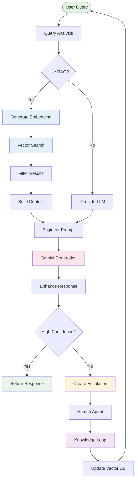

# Draw.io AI Diagram Generation Prompts
## For Knowrex AI System Architecture

---

## 🎨 PROMPT 1: COMPLETE SYSTEM ARCHITECTURE
### Best for: High-level overview presentation

```
Create a comprehensive system architecture diagram for "Knowrex AI - Intelligent RAG-based Customer Support System"

DIAGRAM TYPE: Layered architecture (6 horizontal layers)

═══════════════════════════════════════════════════════════════

LAYER 1 - CLIENT TIER (Top, Light Blue Background):
┌─────────────────────────────────────────────────────────┐
│                     CLIENT DEVICES                       │
│  ┌──────────┐    ┌──────────┐    ┌──────────┐         │
│  │ 🖥️ Web    │    │ 📱 Mobile │    │ 💻 Tablet │         │
│  │ Browser  │    │ Client   │    │ Client   │         │
│  └──────────┘    └──────────┘    └──────────┘         │
│              HTTPS / WebSocket                          │
└─────────────────────────────────────────────────────────┘

═══════════════════════════════════════════════════════════════

LAYER 2 - PRESENTATION TIER (Light Green Background):
┌─────────────────────────────────────────────────────────┐
│              NEXT.JS 14 FRONTEND (React 19)             │
│  ┌─────────────┐ ┌──────────────┐ ┌─────────────┐     │
│  │ Chat UI     │ │ Admin Panel  │ │ Analytics   │     │
│  │ • Messages  │ │ • Documents  │ │ • Reports   │     │
│  │ • Streaming │ │ • Escalations│ │ • Metrics   │     │
│  │ • Citations │ │ • Vectors    │ │ • Insights  │     │
│  └─────────────┘ └──────────────┘ └─────────────┘     │
│                                                          │
│      Tailwind CSS | Lucide Icons | TypeScript          │
└─────────────────────────────────────────────────────────┘

═══════════════════════════════════════════════════════════════

LAYER 3 - API GATEWAY (Orange Background):
┌─────────────────────────────────────────────────────────┐
│               NEXT.JS API ROUTES (REST)                 │
│                                                          │
│  /api/chat ──────────┐    /api/documents ──────┐       │
│  (Streaming)         │    (CRUD)               │       │
│                      │                         │       │
│  /api/escalations ───┤    /api/knowledge ──────┤       │
│  (Tickets)           │    (FAQs)               │       │
│                      │                         │       │
│  /api/embeddings ────┤    /api/upload ─────────┤       │
│  (Vectors)           │    (File Handler)       │       │
│                      │                         │       │
└──────────────────────┴─────────────────────────┴───────┘

═══════════════════════════════════════════════════════════════

LAYER 4 - BUSINESS LOGIC (Purple Background):
┌─────────────────────────────────────────────────────────┐
│                  CORE SERVICE MODULES                    │
│                                                          │
│  ┌──────────────────┐  ┌──────────────────┐            │
│  │  RAG SYSTEM      │  │ ESCALATION SYS   │            │
│  │  ───────────     │  │ ──────────────   │            │
│  │ • Query Process  │  │ • Detection      │            │
│  │ • Vector Search  │  │ • Classification │            │
│  │ • Context Build  │  │ • Routing        │            │
│  │ • Source Cite    │  │ • Lifecycle Mgmt │            │
│  └──────────────────┘  └──────────────────┘            │
│                                                          │
│  ┌──────────────────┐  ┌──────────────────┐            │
│  │ KNOWLEDGE LOOP   │  │ DOC PROCESSOR    │            │
│  │ ──────────────   │  │ ──────────────   │            │
│  │ • FAQ Creation   │  │ • Multi-format   │            │
│  │ • Learning       │  │ • Chunking       │            │
│  │ • Auto-improve   │  │ • Metadata       │            │
│  │ • Pattern Detect │  │ • Validation     │            │
│  └──────────────────┘  └──────────────────┘            │
└─────────────────────────────────────────────────────────┘

═══════════════════════════════════════════════════════════════

LAYER 5 - AI/ML SERVICES (Pink Background):
┌─────────────────────────────────────────────────────────┐
│                AI/ML PROCESSING LAYER                    │
│                                                          │
│  ┌──────────────────────────┐  ┌───────────────────┐   │
│  │  GOOGLE GEMINI 2.0       │  │ XENOVA           │   │
│  │  FLASH API               │  │ TRANSFORMERS     │   │
│  │  ────────────────────    │  │ ──────────────   │   │
│  │  • Text Generation       │  │ • Embeddings     │   │
│  │  • Streaming Response    │  │ • Local Exec     │   │
│  │  • Context: 1M tokens    │  │ • 384-dim        │   │
│  │  • Safety Filters        │  │ • Zero API Cost  │   │
│  │  • Multi-modal           │  │ • all-MiniLM-L6  │   │
│  └──────────────────────────┘  └───────────────────┘   │
│                                                          │
│       External API              Local Browser/Node      │
└─────────────────────────────────────────────────────────┘

═══════════════════════════════════════════════════════════════

LAYER 6 - DATA PERSISTENCE (Gray Background):
┌─────────────────────────────────────────────────────────┐
│                    STORAGE LAYER                         │
│         File-based JSON Storage (Local-First)           │
│                                                          │
│  🗄️ data/chroma/vectors.json                            │
│     └─ Vector embeddings + metadata                     │
│                                                          │
│  📁 data/documents/*.json                                │
│     └─ Document chunks + processing status              │
│                                                          │
│  🎫 data/escalations/*.json                              │
│     └─ Tickets + conversations + resolutions            │
│                                                          │
│  💡 data/faq/*.json                                      │
│     └─ Q&A pairs + source links                         │
│                                                          │
│  📤 public/uploads/                                      │
│     └─ Original uploaded files                          │
└─────────────────────────────────────────────────────────┘

═══════════════════════════════════════════════════════════════

FEEDBACK LOOPS (Dashed purple arrows):
┌─────────────────────────────────────────────────────────┐
│  Knowledge Loop → Vector Store (Purple dashed)          │
│  Escalations → Knowledge Loop (Orange dashed)           │
│  RAG Results → Analytics (Blue dashed)                  │
└─────────────────────────────────────────────────────────┘

═══════════════════════════════════════════════════════════════

EXTERNAL INTEGRATIONS (Right side, yellow boxes):
┌────────────────┐
│ 👤 Human Agent │  ← Escalation notifications
└────────────────┘

┌────────────────┐
│ 🔑 Google API  │  ← Gemini API calls
└────────────────┘

STYLE REQUIREMENTS:
- Use modern, rounded rectangles
- Gradient backgrounds for each layer
- Icons for each component (emoji or SVG)
- Consistent font: Arial or Inter
- Arrow types:
  * Solid black → Primary data flow
  * Dashed blue → Read operations
  * Dashed purple → Learning/feedback
  * Dashed orange → Escalation flow
- Add drop shadows for depth
- Legend in bottom-right corner
```

---

## 🎨 PROMPT 2: RAG PIPELINE FLOWCHART
### Best for: Technical documentation

```
Create a detailed vertical flowchart showing the RAG (Retrieval-Augmented Generation) processing pipeline

TITLE: "Knowrex AI - RAG Processing Pipeline"

START (Green rounded rectangle at top):
┌─────────────────────┐
│  📝 User Query      │
│  "What is your      │
│   refund policy?"   │
└─────────────────────┘
          │
          ▼
┌─────────────────────┐
│ 1️⃣ QUERY ANALYSIS   │
│ ─────────────────   │
│ • Extract keywords  │
│ • Intent detection  │
│ • Language check    │
└─────────────────────┘
          │
          ▼
┌─────────────────────┐
│ ❓ DECISION:        │
│ Should use RAG?     │
│                     │
│ Check: Has docs?    │
│        Complex?     │
│        Factual?     │
└─────────────────────┘
     │            │
    YES          NO
     │            │
     │            └──────────────┐
     ▼                           │
┌─────────────────────┐          │
│ 2️⃣ EMBEDDING GEN    │          │
│ ─────────────────   │          │
│ • Xenova Transform  │          │
│ • 384-dim vector    │          │
│ • Normalize vector  │          │
│ ⏱️ ~100ms            │          │
└─────────────────────┘          │
          │                      │
          ▼                      │
┌─────────────────────┐          │
│ 3️⃣ VECTOR SEARCH    │          │
│ ─────────────────   │          │
│ • Load vectors.json │          │
│ • Cosine similarity │          │
│ • Top-K = 20        │          │
│ • Score > 0.20      │          │
│ ⏱️ ~200ms            │          │
└─────────────────────┘          │
          │                      │
          ▼                      │
┌─────────────────────┐          │
│ 4️⃣ RESULT FILTERING │          │
│ ─────────────────   │          │
│ • Remove duplicates │          │
│ • Apply threshold   │          │
│ • Rank by score     │          │
│ • Dedupe by doc     │          │
└─────────────────────┘          │
          │                      │
          ▼                      │
┌─────────────────────┐          │
│ 5️⃣ CONTEXT BUILD    │          │
│ ─────────────────   │          │
│ • Concatenate chunks│          │
│ • Add separators    │          │
│ • Format citations  │          │
│ • Max 3000 chars    │          │
└─────────────────────┘          │
          │                      │
          ▼                      │
┌─────────────────────┐          │
│ 6️⃣ PROMPT ENGINEER  │ ◀────────┘
│ ─────────────────   │
│ • System prompt     │
│ • Insert context    │
│ • Add instructions  │
│ • Citation format   │
└─────────────────────┘
          │
          ▼
┌─────────────────────┐
│ 7️⃣ LLM GENERATION   │
│ ─────────────────   │
│ • Send to Gemini    │
│ • Stream response   │
│ • Parse citations   │
│ ⏱️ ~1000ms           │
└─────────────────────┘
          │
          ▼
┌─────────────────────┐
│ 8️⃣ RESPONSE ENHANCE │
│ ─────────────────   │
│ • Attach sources    │
│ • Add confidence    │
│ • Format markdown   │
│ • Include metadata  │
└─────────────────────┘
          │
          ▼
┌─────────────────────┐
│ 9️⃣ ESCALATION CHECK │
│ ─────────────────   │
│ • Confidence < 0.5? │
│ • Sensitive topic?  │
│ • Error keywords?   │
└─────────────────────┘
     │            │
    LOW          HIGH
  CONFIDENCE    CONFIDENCE
     │            │
     ▼            │
┌─────────────────┐   │
│ 🚨 ESCALATE     │   │
│ Create ticket   │   │
│ Notify human    │   │
└─────────────────┘   │
                      │
                      ▼
             ┌─────────────────┐
             │ ✅ RETURN        │
             │ • Response text  │
             │ • Sources[]      │
             │ • Confidence     │
             │ • Citations[]    │
             └─────────────────┘
                      │
                      ▼
                    [END]

VISUAL STYLING:
- Gradient fill for each step (light to dark from top to bottom)
- Drop shadows on all boxes
- Rounded corners (10px radius)
- Decision diamonds in yellow
- Processing steps in blue
- Escalation path in orange
- Success path in green
- Add timing annotations (⏱️) where applicable
- Use emojis for visual anchors
- Font: Inter or Roboto, 12-14pt
- Add miniature data flow indicators between steps
```

---

## 🎨 PROMPT 3: ESCALATION & KNOWLEDGE LOOP
### Best for: Process documentation

```
Create a circular continuous improvement diagram showing Knowrex's learning cycle

DIAGRAM TYPE: Circular flow with 9 stages

TITLE: "Knowrex AI - Continuous Learning & Knowledge Loop"

CENTER CIRCLE (Large, gradient purple):
┌─────────────────────┐
│   KNOWREX AI BRAIN  │
│                     │
│   🧠 Continuously   │
│      Learning       │
│                     │
│   Knowledge Base    │
│   Growing: +12/mo   │
└─────────────────────┘

OUTER RING - 9 STAGES (Clockwise from top):

🕐 12:00 - STAGE 1: USER QUERY
┌─────────────────────┐
│  👤 User asks:      │
│  "How do I return   │
│   a product?"       │
│                     │
│  📊 Status: New     │
└─────────────────────┘
          ↓

🕑 01:30 - STAGE 2: AI ATTEMPTS ANSWER
┌─────────────────────┐
│  🤖 RAG System      │
│  • Search vectors   │
│  • Retrieve context │
│  • Generate reply   │
│                     │
│  ⏱️ Response: 1.5s   │
└─────────────────────┘
          ↓

🕒 03:00 - STAGE 3: CONFIDENCE CHECK
┌─────────────────────┐
│  📊 Evaluation      │
│                     │
│  Confidence: 0.35   │
│  Threshold: 0.50    │
│                     │
│  ⚠️ BELOW THRESHOLD │
└─────────────────────┘
          ↓

🕓 04:30 - STAGE 4: ESCALATION TRIGGER
┌─────────────────────┐
│  🚨 Auto-Escalate   │
│                     │
│  Reason: Low conf.  │
│  Urgency: MEDIUM    │
│  Ticket: #ESC-4721  │
│                     │
│  📝 Context saved   │
└─────────────────────┘
          ↓

🕔 06:00 - STAGE 5: HUMAN AGENT
┌─────────────────────┐
│  👨‍💼 Agent Review    │
│                     │
│  • View history     │
│  • Check context    │
│  • Research answer  │
│                     │
│  👤 Agent: Sarah K. │
└─────────────────────┘
          ↓

🕕 07:30 - STAGE 6: EXPERT RESOLUTION
┌─────────────────────┐
│  ✅ Answer Provided │
│                     │
│  "You can return    │
│   within 30 days    │
│   with receipt..."  │
│                     │
│  ⭐ Quality: High   │
└─────────────────────┘
          ↓

🕖 09:00 - STAGE 7: KNOWLEDGE CAPTURE
┌─────────────────────┐
│  💾 FAQ Creation    │
│                     │
│  Q: Return policy?  │
│  A: [Expert answer] │
│                     │
│  📝 Auto-generated  │
│  🔗 Source: ESC-4721│
└─────────────────────┘
          ↓

🕗 10:30 - STAGE 8: EMBEDDING & INDEXING
┌─────────────────────┐
│  🔢 Vector Generate │
│                     │
│  • Embed FAQ text   │
│  • Create vector    │
│  • Add to database  │
│                     │
│  🔍 Now searchable  │
└─────────────────────┘
          ↓

🕘 12:00 - STAGE 9: ENHANCED RAG
┌─────────────────────┐
│  📈 System Improved │
│                     │
│  Next query will:   │
│  • Find FAQ         │
│  • High confidence  │
│  • No escalation    │
│                     │
│  ♻️ Cycle complete  │
└─────────────────────┘
          ↓
    [Return to START]

METRICS CORNERS (4 stat boxes):

TOP-LEFT:
┌────────────────┐
│ ⏱️ Response Time│
│                │
│  Week 1: 2.5s  │
│  Week 8: 1.2s  │
│                │
│  ↓ 52% faster  │
└────────────────┘

TOP-RIGHT:
┌────────────────┐
│ 🚨 Escalations │
│                │
│  Week 1: 28%   │
│  Week 8: 12%   │
│                │
│  ↓ 57% reduced │
└────────────────┘

BOTTOM-LEFT:
┌────────────────┐
│ ⏳ Resolution  │
│                │
│  Avg: 18 mins  │
│  Median: 12m   │
│                │
│  📊 Improving  │
└────────────────┘

BOTTOM-RIGHT:
┌────────────────┐
│ 💡 Knowledge   │
│                │
│  FAQs: 143     │
│  Growth: +12/mo│
│                │
│  📈 Expanding  │
└────────────────┘

ARROWS:
- Thick curved arrows connecting stages (gradient from blue to purple)
- Dashed feedback arrow from Stage 9 back to Center
- "Improvement Loop" label on feedback arrow

COLOR SCHEME:
- Normal flow: Blue → Purple gradient
- Escalation: Orange highlights
- Resolution: Green highlights
- Learning: Purple highlights

ANNOTATIONS:
- Add timeline progression labels (Week 1 → Week 8)
- Include success rate percentage: "Success Rate: 88%"
- Add "Continuous Learning System" as subtitle
```

---

## 🎨 PROMPT 4: PROPOSED WORKFLOW STRUCTURE
### Based on attached image, adapted for Knowrex

```
Create a professional workflow structure diagram showing conversation processing pipeline

TITLE: "Knowrex AI - Conversation Workflow Structure"

LAYOUT: Left-to-right flow with parallel components

═══════════════════════════════════════════════════════════════

LEFT SECTION - WORKFLOW DEFINITION:
┌─────────────────────────────────────────┐
│       CONVERSATION FLOW DEFINITION      │
│                                         │
│  ┌──────────────┐    ┌──────────────┐  │
│  │   Flow       │    │   Flow       │  │
│  │   Edges      │    │   Nodes      │  │
│  │              │    │              │  │
│  │ • Edge ID    │    │ • Node ID    │  │
│  │ • Source─────┼────┼→ Node Type   │  │
│  │ • Target     │    │ • Node Data  │  │
│  │ • Condition  │    │ • Position   │  │
│  └──────────────┘    └──────────────┘  │
└─────────────────────────────────────────┘
                │
                ▼

MIDDLE SECTION - NODE TYPES (Branching from center):
                ┌────────────────────────┐
                │     NODE TYPES         │
                │     ──────────         │
                │                        │
                │  1. User Input         │
                │  2. Query Embedding    │
                │  3. Vector Search      │
                │  4. Context Build      │
                │  5. LLM Generation     │
                │  6. Escalation Check   │
                │  7. Human Review       │
                │  8. Knowledge Create   │
                │  9. Response Output    │
                └────────────────────────┘
                           │
                ┌──────────┼──────────┐
                ▼          ▼          ▼

TOP BRANCH - INPUT NODE:
┌──────────────────────────────────────────┐
│            INPUT NODE                    │
│                                          │
│  ┌─────────────┐                        │
│  │   Message   │  ⎯⎯→  Processing       │
│  │             │                         │
│  │ • Text      │       ┌──────────────┐ │
│  │ • Context   │  ⎯⎯→  │ Validate     │ │
│  │ • History   │       │ Sanitize     │ │
│  │ • Metadata  │       │ Normalize    │ │
│  └─────────────┘       └──────────────┘ │
└──────────────────────────────────────────┘

MIDDLE BRANCH - TRANSFORM NODE:
┌──────────────────────────────────────────┐
│         TRANSFORMATION NODE              │
│                                          │
│  ┌────────────────────────────────────┐ │
│  │   Transform Types                  │ │
│  │                                    │ │
│  │  • Filter        • Normalize       │ │
│  │  • Embed         • Rank            │ │
│  │  • Chunk         • Format          │ │
│  │  • Extract       • Validate        │ │
│  │                                    │ │
│  │  Conditions:                       │ │
│  │  • Confidence > threshold          │ │
│  │  • Contains keywords               │ │
│  │  • Matches pattern                 │ │
│  └────────────────────────────────────┘ │
└──────────────────────────────────────────┘

BOTTOM BRANCH - OUTPUT NODE:
┌──────────────────────────────────────────┐
│            OUTPUT NODE                   │
│                                          │
│  ┌─────────────┐                        │
│  │  Response   │                         │
│  │             │                         │
│  │ • Text      │  ┌──────────────┐      │
│  │ • Sources   │  │ Format       │      │
│  │ • Citations │  │ Validate     │      │
│  │ • Metadata  │  │ Enrich       │      │
│  │ • Score     │  └──────────────┘      │
│  └─────────────┘                        │
└──────────────────────────────────────────┘

═══════════════════════════════════════════════════════════════

RIGHT SECTION - STORAGE & FORMATS:

┌──────────────────────────────────┐
│         STORAGE LAYER            │
│                                  │
│  📦 Data Formats                 │
│  ─────────────                   │
│                                  │
│  ┌────────────────┐              │
│  │ Documents      │              │
│  │  • JSON        │              │
│  │  • Chunks[]    │              │
│  │  • Metadata    │              │
│  └────────────────┘              │
│                                  │
│  ┌────────────────┐              │
│  │ Vectors        │              │
│  │  • Embeddings  │              │
│  │  • Dimensions  │              │
│  │  • Index       │              │
│  └────────────────┘              │
│                                  │
│  ┌────────────────┐              │
│  │ Escalations    │              │
│  │  • Tickets     │              │
│  │  • History     │              │
│  │  • Status      │              │
│  └────────────────┘              │
│                                  │
│  ┌────────────────┐              │
│  │ Knowledge      │              │
│  │  • FAQs        │              │
│  │  • Q&A pairs   │              │
│  │  • Sources     │              │
│  └────────────────┘              │
└──────────────────────────────────┘

BOTTOM - FILE FORMAT SPECIFICATIONS:

┌─────────────────────────────────────────┐
│        SUPPORTED FILE FORMATS           │
│                                         │
│  Input:              Output:            │
│  ─────               ───────            │
│  • .txt              • .json            │
│  • .pdf              • .csv             │
│  • .docx             • .xml             │
│  • .json             • API Response     │
│  • .md               • Stream           │
└─────────────────────────────────────────┘

CONNECTIONS:
- Solid arrows for data flow
- Dashed arrows for conditional paths
- Double arrows for bidirectional sync
- Color coding:
  * Blue: Input/Processing
  * Green: Success paths
  * Orange: Conditional/Escalation
  * Purple: Storage operations

STYLE:
- Modern rounded rectangles
- Consistent padding (15px)
- Font: Inter or Segoe UI
- Icons: Use Lucide or Feather icon set
- Drop shadows for depth
- Gradient backgrounds (subtle)
- Border radius: 8px
```

---

## 🎨 PROMPT 5: DATA FLOW ARCHITECTURE
### Best for: Technical deep-dive

```
Create a detailed data flow diagram showing how information moves through Knowrex

DIAGRAM TYPE: Swimlane diagram with 5 lanes

TITLE: "Knowrex AI - End-to-End Data Flow Architecture"

═══════════════════════════════════════════════════════════════

SWIMLANE 1 - CLIENT LAYER (Top lane, light blue):
┌─────────────────────────────────────────────────────────────┐
│  CLIENT                                                      │
│                                                              │
│  [User Browser] → {User types query} → [Submit]             │
│                                                              │
│  ← [Streaming response appears] ← [Citations shown]         │
└─────────────────────────────────────────────────────────────┘
                         │                    ▲
                         │ HTTP POST          │ SSE Stream
                         ▼                    │
═══════════════════════════════════════════════════════════════

SWIMLANE 2 - API LAYER (Orange):
┌─────────────────────────────────────────────────────────────┐
│  API GATEWAY                                                 │
│                                                              │
│  [/api/chat endpoint receives request]                      │
│         │                                                    │
│         ├─→ Validate input                                  │
│         ├─→ Extract message                                 │
│         ├─→ Load conversation history                       │
│         └─→ Initialize response stream                      │
└─────────────────────────────────────────────────────────────┘
                         │
                         ▼
═══════════════════════════════════════════════════════════════

SWIMLANE 3 - PROCESSING LAYER (Purple):
┌─────────────────────────────────────────────────────────────┐
│  CORE LOGIC                                                  │
│                                                              │
│  Step 1: [RAG System]                                       │
│           └─→ Analyze query                                 │
│                 └─→ Trigger: Use RAG? (YES)                 │
│                                                              │
│  Step 2: [Generate embedding]                               │
│           └─→ Xenova Transformers                           │
│                 └─→ Output: [0.23, -0.45, ..., 0.12]       │
│                     (384 dimensions)                         │
│                                                              │
│  Step 3: [Vector Search]                                    │
│           └─→ Load vectors from storage                     │
│           └─→ Calculate cosine similarity                   │
│           └─→ Return top 20 matches                         │
│                                                              │
│  Step 4: [Context Assembly]                                 │
│           └─→ Combine chunks                                │
│           └─→ Format with sources                           │
│           └─→ Add metadata                                  │
│                                                              │
│  Step 5: [Prompt Engineering]                               │
│           └─→ Insert context into template                  │
│           └─→ Add instructions                              │
│           └─→ Build final prompt                            │
│                                                              │
│  Step 6: [Escalation Check]                                 │
│           └─→ Confidence score check                        │
│           └─→ Keyword detection                             │
│           └─→ Decision: Escalate? (NO)                      │
└─────────────────────────────────────────────────────────────┘
                         │                    │
             API Call    │                    │ If YES →
                         ▼                    ▼
═══════════════════════════════════════════════════════════════

SWIMLANE 4 - AI LAYER (Pink):
┌─────────────────────────────────────────────────────────────┐
│  AI/ML SERVICES                                              │
│                                                              │
│  Main Path:                  Branch Path:                   │
│  ┌──────────────────┐        ┌──────────────────┐          │
│  │ Google Gemini    │        │ Human Agent      │          │
│  │                  │        │                  │          │
│  │ Receives:        │        │ Receives:        │          │
│  │ • System prompt  │        │ • Escalation     │          │
│  │ • Context        │        │ • Full context   │          │
│  │ • User query     │        │ • History        │          │
│  │                  │        │                  │          │
│  │ Generates:       │        │ Provides:        │          │
│  │ • Text stream    │        │ • Expert answer  │          │
│  │ • Token by token │        │ • Resolution     │          │
│  └──────────────────┘        └──────────────────┘          │
│           │                            │                    │
│           ▼                            ▼                    │
│  [Response text]            [Knowledge Loop triggered]      │
└─────────────────────────────────────────────────────────────┘
                         │                    │
                         ▼                    ▼
═══════════════════════════════════════════════════════════════

SWIMLANE 5 - DATA LAYER (Gray):
┌─────────────────────────────────────────────────────────────┐
│  STORAGE                                                     │
│                                                              │
│  READ Operations:            WRITE Operations:              │
│  ┌─────────────────┐        ┌─────────────────┐            │
│  │ vectors.json    │        │ escalations/    │            │
│  │ (Load vectors)  │        │ (Save ticket)   │            │
│  └─────────────────┘        └─────────────────┘            │
│           │                          │                      │
│  ┌─────────────────┐        ┌─────────────────┐            │
│  │ documents/      │        │ faq/            │            │
│  │ (Load metadata) │        │ (New FAQ entry) │            │
│  └─────────────────┘        └─────────────────┘            │
│           │                          │                      │
│           └──────────┬───────────────┘                      │
│                      ▼                                      │
│              [File System I/O]                              │
└─────────────────────────────────────────────────────────────┘

═══════════════════════════════════════════════════════════════

DATA OBJECTS FLOWING (Show as colored boxes moving through lanes):

🟦 Query Object:
{
  message: "What is your refund policy?",
  sessionId: "abc123",
  timestamp: "2026-02-13T10:30:00Z"
}

🟩 Context Object:
{
  chunks: [...],
  sources: [...],
  confidence: 0.72
}

🟨 Response Object:
{
  text: "Our refund policy...",
  sources: [{doc: "policy.pdf", ...}],
  escalated: false
}

🟧 Escalation Object:
{
  id: "ESC-4521",
  query: "...",
  reason: "low_confidence",
  urgency: "medium"
}

LEGEND (Bottom-right):
┌────────────────────────┐
│ Arrow Types:           │
│ ────→  Data flow       │
│ ····→  Conditional     │
│ ═══→  API call         │
│ - - →  Async/Event     │
└────────────────────────┘

STYLE:
- Each swimlane has distinct background color
- Use containers for processes
- Show data objects as colored rectangles with JSON
- Include timing estimates: ⏱️ 200ms annotations
- Add decision points as diamond shapes
- Show parallel processes side-by-side
- Font: Courier for code, Inter for text
```

---

## 📋 USAGE INSTRUCTIONS

### How to Use These Prompts with Draw.io AI:

1. **Open Draw.io**: Go to app.diagrams.net or use VS Code extension
2. **Enable AI Features**: Look for "Generate with AI" or similar option
3. **Copy Prompt**: Copy the entire prompt block (including the ASCII structure)
4. **Paste & Generate**: Paste into the AI prompt field
5. **Refine**: Use follow-up prompts to adjust:
   - "Make colors more vibrant"
   - "Add more spacing between components"
   - "Change to vertical layout"
   - "Add icons to each box"
   - "Make it more minimalist"

### Prompt Customization Tips:

- **For presentations**: Use Prompt 1 or 3 (high-level, visual)
- **For documentation**: Use Prompt 2 or 5 (detailed, technical)
- **For process docs**: Use Prompt 3 or 4 (workflow-focused)

### Alternative Tools:

If Draw.io AI isn't available, these prompts also work with:
- **Lucidchart AI**
- **Miro AI**
- **Excalidraw + ChatGPT** (generate, then manually draw)
- **PlantUML** (generate PlantUML code first)
- **Mermaid.js** (convert prompt to Mermaid syntax)

---

## 🎨 BONUS: Mermaid.js Conversion

If you prefer code-based diagrams, here's the RAG flow in Mermaid:



Use this in any Mermaid viewer or GitHub/GitLab markdown!

---

**Document Version:** 1.0  
**Created:** February 13, 2026  
**Purpose:** Draw.io AI diagram generation prompts for Knowrex AI
